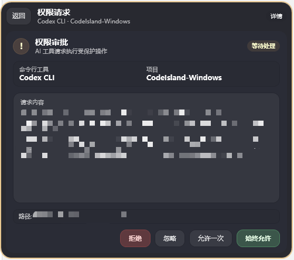

# CodeIsland for Windows

<p align="center">
  
</p>

> 不切换窗口，就能实时看到 AI 编程代理在做什么。

CodeIsland 是一个 **AI 编程代理状态面板**。本项目是基于开源项目 [CodeIsland](https://github.com/wxtsky/CodeIsland) 实现的 Windows 版本，以桌面 HUD 浮窗形式呈现。当前通过内置 CodeOrbit Runtime 支持多种 AI 编程工具，通过 Hook 机制监听实时事件，在屏幕顶部展示会话状态、权限审批、问答交互和最近任务细节。

项目仓库：https://github.com/KelseySking/CodeIsland-Windows

## 应用截图

<p align="center">
  
</p>

<p align="center">
  
</p>

<p align="center">
  
</p>

## 功能特性

- **AI 代理实时监控** — 通过 CodeOrbit Runtime 的工具插件支持多种 AI 编程工具
- **桌面 HUD 浮窗** — 顶部/侧边/底部悬浮展示，折叠与展开自动切换，不抢焦点
- **会话列表与详情** — 实时查看运行状态、当前工具、最近消息、完成摘要和任务详情
- **权限审批** — 直接在面板上批准或拒绝工具权限请求，支持全局快捷键操作
- **问答交互** — 在面板上回答 AI 工具的提问，无需切换回终端窗口
- **终端跳转** — 一键跳转到对应终端标签页，支持 Windows Terminal 标签级精确切换
- **Hook 自动安装** — 从设置界面连接或断开支持的 AI 编程工具（Windows 与 WSL 可分别管理）
- **Webhook 转发** — 可将关键通知异步投递到自定义 HTTP(S) 地址

- **8-bit 音效** — 会话启动、完成、审批等事件的像素风音效
- **全局快捷键** — 默认 `Ctrl+Alt+I` 切换面板、`Ctrl+Alt+Y` 批准、`Ctrl+Alt+N` 拒绝
- **自动更新** — 通过 GitHub Releases 检查新版本

## 技术栈

| 组件 | 选型 |
|------|------|
| 语言/运行时 | C# / .NET 8 |
| UI 框架 | WPF + WPF-UI |
| 音效 | NAudio |
| 快捷键 | `RegisterHotKey` P/Invoke |

## 架构

CodeIsland for Windows 是一个纯**展示客户端**（HUD），通过 REST 和 WebSocket API 连接内嵌的 [CodeOrbit Runtime](https://github.com/KelseySking/CodeOrbit-Rust)。Runtime 负责 Hook 事件接收、状态聚合和会话管理；WPF 应用仅负责 UI 渲染和用户交互。


```text
┌──────────────────────┐         ┌─────────────────────────┐
│ CodeOrbit Runtime    │◄────────│ CodeIsland-Windows      │
│ (内嵌，自动启动)      │  REST   │ (纯展示客户端)           │
│                      │  +WS    │                         │
│ Hook 事件 → 状态     │         │ UI：HUD、审批、          │
│ 聚合 → API 接口      │         │ 问答、会话详情          │
└──────────────────────┘         └─────────────────────────┘
```

### 项目结构

```text
src/
├── CodeIsland.Contracts/     # API DTO 契约（与 CodeOrbit Runtime 对齐）
└── CodeIsland.WpfApp/        # WPF 展示客户端
    ├── ViewModels/           # 应用状态与 HUD 视图模型
    ├── Views/                # HUD、会话列表、审批、问答、详情、设置
    ├── Services/             # Runtime API 客户端、进程管理、终端、快捷键、更新
    └── Assets/               # 图标、音效
scripts/                      # 构建、发布、打包脚本
samples/
└── external-display-console/ # 示例：连接 Runtime API
```

## 快速开始

### 环境要求

- Windows 10/11
- .NET 8 SDK

### 构建

```powershell
dotnet build
dotnet build -c Release
```

### 启动

```powershell
dotnet run --project src/CodeIsland.WpfApp
```

启动后会显示 HUD 浮窗，并在托盘区创建 CodeIsland 图标。在 managed 模式下，应用会自动启动内嵌的 `codeorbit-host.exe`，通过 REST/WebSocket 连接 `http://127.0.0.1:32145`。

### 发布与打包

内嵌 Runtime 默认来自仓库中的 `external/CodeOrbit`，版本由 `external/CodeOrbit/runtime-pin.json` 钉死（当前为 CodeOrbit-Rust **v0.1.3**，含增强 WSL source API）。

```powershell
# 按 pin 从 GitHub 同步 Runtime（默认可复现）
.\scripts\sync-codeorbit-runtime.ps1

# 可选：同步最新 release（会写回 pin）
.\scripts\sync-codeorbit-runtime.ps1 -Latest

# 单文件自包含发布
.\scripts\publish-single-file.ps1

# 发布 ZIP（可选打包前同步 Runtime）
.\scripts\create-release-zip.ps1
.\scripts\create-release-zip.ps1 -SyncRuntime

# Windows 安装程序（需安装 Inno Setup 6）
.\scripts\create-installer.ps1
.\scripts\create-installer.ps1 -SyncRuntime
# 强制最新 Runtime 再打包：
# .\scripts\create-installer.ps1 -SyncRuntime -LatestRuntime
```

## Hook 安装

打开**设置 > 工具连接**，即可连接或断开支持的工具：

- **Windows**：在当前 Windows 用户配置中安装/卸载 hook
- **WSL**（检测到发行版时显示）：选择发行版后单独安装/卸载 WSL 内 hook；hook 经 WSL interop 调用 Windows 侧 `codeorbit-bridge.exe`，与 Windows 连接状态相互独立

工具列表由内置 CodeOrbit Runtime 插件提供。WSL 列表与状态在后台加载并带超时，避免阻塞设置页。后续 Runtime 更新可以新增或更新工具集成，而不需要修改展示客户端。

| 工具 | 状态 |

|------|------|
| AntiGravity | 已适配 |
| Claude Code | 已适配 |
| Cline | 已适配 |
| CodeBuddy | 已适配 |
| Codex CLI | 已适配 |
| Cursor | 已适配 |
| Factory | 已适配 |
| Gemini CLI | 已适配 |
| GitHub Copilot | 已适配 |
| Hermes | 已适配 |
| Kimi Code | 已适配 |
| Kiro | 已适配 |
| OpenCode | 已适配 |
| Pi | 已适配 |
| Qoder | 已适配 |
| Qwen Code | 已适配 |
| StepFun | 已适配 |
| Trae | 已适配 |
| WorkBuddy | 已适配 |

## 配置

设置文件位于 `%APPDATA%\CodeIsland\settings.json`，可通过设置界面或直接编辑。

| 分类 | 设置项 | 默认值 |
|------|--------|--------|
| 通用 | 开机自启 | `false` |
| 通用 | 显示位置 | `top-center` |
| 行为 | 自动审批安全工具 | `true` |
| 行为 | Webhook URL | 空字符串 |
| 行为 | 会话超时（秒） | `300` |
| 行为 | 智能抑制 | `true` |
| 行为 | 全屏时隐藏 | `true` |
| 外观 | 面板高度模式 | `auto` |
| 外观 | 显示完整最近消息 | `false` |
| 音效 | 启用音效 | `true` |
| 音效 | 音量 | `0.7` |
| 快捷键 | 切换面板 | `Ctrl+Alt+I` |
| 快捷键 | 批准 | `Ctrl+Alt+Y` |
| 快捷键 | 拒绝 | `Ctrl+Alt+N` |

## 致谢

本项目受 [CodeIsland (macOS)](https://github.com/wxtsky/CodeIsland) 启发，感谢原作者 [@wxtsky](https://github.com/wxtsky)。Windows 版在"不切换窗口，实时监控 AI 代理"的核心设计理念基础上，针对 Windows 桌面环境进行了深度适配。

## 许可证

MIT License

<center>该项目已在 [LINUX DO](https://linux.do) 社区分享。</center>
