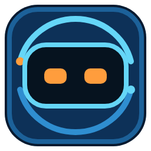
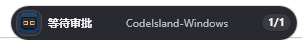
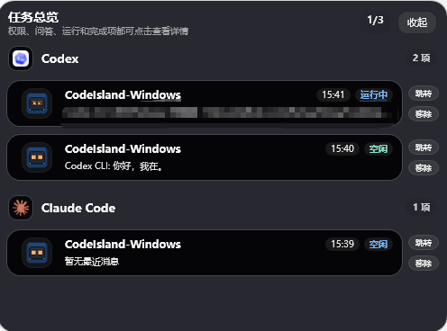

# CodeIsland for Windows

<p align="center">
  
</p>

> 不切换窗口，就能实时看到 AI 编程代理在做什么。


CodeIsland 是一个 **AI 编程代理状态面板**。本项目是基于开源项目 [CodeIsland](https://github.com/wxtsky/CodeIsland) 实现的Windows版本。macOS 版锚定在 MacBook 刘海区域，Windows 版以桌面 HUD 浮窗形式呈现。当前 Windows 版已适配 Claude Code 和 Codex，通过 Hook 机制监听实时事件，在屏幕顶部展示会话状态、权限审批、问答交互和最近任务细节。

项目仓库：https://github.com/KelseySking/CodeIsland-Windows

## 应用截图

<p align="center">
  
</p>

<p align="center">
  
</p>

## 功能特性

- **AI 代理实时监控** — 已端到端适配 Claude Code 和 Codex；Gemini CLI、Cursor、GitHub Copilot、Cline 等其他工具属于后续适配计划
- **桌面 HUD 浮窗** — 顶部/侧边/底部悬浮展示，折叠与展开自动切换，不抢焦点
- **会话列表与详情** — 实时查看运行状态、当前工具、最近消息、完成摘要和任务详情
- **权限审批** — 直接在面板上批准或拒绝工具权限请求，支持全局快捷键操作
- **问答交互** — 在面板上回答 AI 工具的提问，无需切换回终端窗口
- **终端跳转** — 一键跳转到对应终端标签页，支持 Windows Terminal 标签级精确切换
- **Hook 自动安装** — 从设置界面为 Claude Code 和 Codex 安装或卸载 CodeIsland Hook
- **Webhook 转发** — 可将关键通知异步投递到自定义 HTTP(S) 地址
- **8-bit 音效** — 会话启动、完成、审批等事件的像素风音效
- **全局快捷键** — 默认 `Ctrl+Alt+I` 切换面板、`Ctrl+Alt+Y` 批准、`Ctrl+Alt+N` 拒绝
- **自动更新** — 通过当前项目的 GitHub Releases 检查新版本

## 技术栈

| 组件 | 选型 |
|------|------|
| 语言/运行时 | C# / .NET 8 (`net8.0` / `net8.0-windows`) |
| UI 框架 | WPF + WPF-UI |
| IPC | Named Pipes，4 字节 little-endian 长度前缀 + UTF-8 JSON |
| 本地 API | ASP.NET Core Minimal API + WebSocket，默认绑定 `127.0.0.1` |
| 进程查询 | WMI / `System.Management` |
| 音效 | NAudio |
| 快捷键 | `RegisterHotKey` P/Invoke |
| 测试 | xUnit |

## 项目结构

```text
CodeIsland.Windows/
├── src/
│   ├── CodeIsland.Contracts/     # 本地 API / Hub DTO 合同
│   ├── CodeIsland.Core/          # 平台无关核心库
│   │   ├── Models/               # HookEvent, SessionSnapshot, AgentStatus, SupportedSource
│   │   ├── Services/             # EventNormalizer, ConfigInstaller, L10n, SettingsManager
│   │   └── IPC/                  # Named Pipe 路径与消息协议
│   ├── CodeIsland.Bridge/        # 短生命周期 Hook Bridge：stdin JSON → Named Pipe
│   │   ├── Program.cs
│   │   ├── ProcessAncestry.cs    # WMI 进程族谱解析
│   │   ├── SourceResolver.cs     # AI 工具来源识别
│   │   └── EnvironmentCollector.cs
│   ├── CodeIsland.Hub/           # 本地 Hub：CLI 操作接口、source 管理、HTTP/WebSocket API
│   ├── CodeIsland.RuntimeHost/   # 独立 Runtime 进程，供各类展示客户端连接
│   └── CodeIsland.WpfApp/        # WPF 主应用
│       ├── ViewModels/           # WpfAppState 与 HUD 视图模型
│       ├── Views/                # HUD、会话列表、审批、问答、详情、设置、关于
│       ├── Services/             # RuntimeApiClient, RuntimeProcessManager, TerminalActivator, GlobalHotkey, UpdateChecker
│       └── Assets/               # 图标、音效
├── tests/
│   ├── CodeIsland.Core.Tests/
│   ├── CodeIsland.Bridge.Tests/
│   └── CodeIsland.Hub.Tests/
├── scripts/                      # 构建、发布、打包脚本
└── docs/                         # 技术规格、变更日志、硬件/渲染说明
```

Runtime 层正在拆分到独立的 `CodeIsland-Runtime` 仓库。Runtime 内部依赖方向为：`CodeIsland.Bridge -> CodeIsland.Core`，`CodeIsland.Hub -> CodeIsland.Contracts + CodeIsland.Core`，`CodeIsland.RuntimeHost -> CodeIsland.Hub + CodeIsland.Core`。Windows HUD 现在是展示客户端：`CodeIsland.WpfApp -> CodeIsland.Contracts`，发布时再携带 RuntimeHost/Bridge 可执行产物。

## 快速开始

### 环境要求

- Windows 10/11
- .NET 8 SDK

### 构建

仓库使用 `CodeIsland.slnx`，根目录 `dotnet build` 会构建 solution 中的所有项目。

```powershell
dotnet build
dotnet build -c Release
```

也可以运行完整构建脚本：

```powershell
.\scripts\build.ps1
```

### 启动应用（开发环境）

从仓库根目录启动 WPF 主应用：

```powershell
dotnet run --project src/CodeIsland.WpfApp
```

启动后会显示 HUD 浮窗，并在托盘区创建 CodeIsland 图标。在 managed 模式下，HUD 会启动 `CodeIsland.RuntimeHost`，默认监听 `http://127.0.0.1:32145`，并通过 REST/WebSocket 连接 Runtime。Hook 事件由 `CodeIsland.Bridge` 作为短生命周期子进程转发到 Runtime，不需要手动常驻运行 Bridge。
API token 保存在 `%APPDATA%\CodeIsland\settings.json` 的 `api_token`。

### 运行测试

```powershell
# 运行全部测试
dotnet test

# 运行单个测试项目
dotnet test tests/CodeIsland.Core.Tests
dotnet test tests/CodeIsland.Bridge.Tests

# 运行匹配名称的测试
dotnet test tests/CodeIsland.Core.Tests --filter FullyQualifiedName~EventNormalizer
```

### 发布单文件

```powershell
.\scripts\publish-single-file.ps1
```

### 打包发布 ZIP

```powershell
.\scripts\create-release-zip.ps1
```

### 打包 Windows 安装程序

需要先安装 Inno Setup 6，并确保 `ISCC.exe` 在 PATH 中，或通过 `-InnoSetupCompiler` 指定路径。

```powershell
.\scripts\create-installer.ps1
```

### 启动应用（发布包）

解压发布 ZIP 后直接运行：

```powershell
.\CodeIsland-Windows.exe
```

首次启动后，可在设置界面的 Hooks 标签页为 Claude Code 和 Codex 安装 Hook。其他 AI 工具适配尚未开放。

## 工作原理

```text
AI 工具触发 Hook 事件（当前为 Claude Code 和 Codex）
  → codeisland-bridge.exe（每次 Hook 调用启动一次）
    → 从 stdin 读取 JSON
    → 采集 Windows 环境变量
    → WMI 查询进程族谱，识别来源 CLI 与跟踪进程
    → 通过 Named Pipe 发送富化 JSON 到 CodeIsland.RuntimeHost
      → Runtime HookServer 接收并按事件类型路由
        → 权限请求 / 问答请求 → Runtime 等待 REST 操作并返回 Hook 响应
        → 生命周期事件 → SessionSnapshot.ReduceEvent() 计算新状态
          → Runtime 发布 REST 快照和 WebSocket 事件
            → WPF AppState 投影 Runtime 状态并渲染 HUD
```

`PermissionRequest`、显式需要审批的 `PreToolUse`、带问题 payload 的 `Notification`/`Question*` 会作为阻塞事件等待用户响应。普通事件会先返回 `{}` ack，再异步更新 UI，避免短生命周期 Bridge 过早断开导致事件丢失或管道噪声。

## Runtime API

WPF HUD 是默认客户端；Web、插件、手机、硬件屏幕和其他前端都可以通过同一组 token 认证的 Runtime API 接入。Runtime 默认只绑定 `127.0.0.1`。远程访问需要显式设置 `api_bind_host=0.0.0.0`；配对、CORS 和更完整的远程安全体验属于后续任务。

外部展示端开发入口见 `docs/external-display-client.md`，无外部依赖的控制台示例位于 `samples/external-display-console`。

请求认证支持：

- `Authorization: Bearer <api_token>`
- `X-CodeIsland-Token: <api_token>`
- WebSocket 可使用 `ws://127.0.0.1:32145/api/events?token=<api_token>`

当前接口面包括：

- `GET /api/health`
- `GET /api/version`
- `GET /api/capabilities`
- `GET /api/sources`
- `POST /api/sources/{source}/install`
- `POST /api/sources/{source}/uninstall`
- `POST /api/sources/{source}/repair`
- `GET /api/runtime-assets`
- `POST /api/runtime-assets/repair`
- `GET /api/sessions`
- `GET /api/sessions/{sessionId}`
- `GET /api/sessions/{sessionId}/messages`
- `GET /api/pending`
- `POST /api/permissions/{actionId}/allow`
- `POST /api/permissions/{actionId}/deny`
- `POST /api/questions/{actionId}/answer`
- `POST /api/questions/{actionId}/answer-current`
- `POST /api/questions/{actionId}/dismiss`
- `WS /api/events`

## Hook 安装

当前用户可见的 Hook 安装入口开放 Claude Code 和 Codex：

| 格式 | 工具 | 已验证版本 | 状态 |
|------|------|------|------|
| `.claude` | Claude Code | `v2.1.145` | 已适配 |
| `.codex` | Codex | `v0.137.0` | 已适配 |

Gemini CLI、Cursor、GitHub Copilot、Cline 等其他工具属于后续适配计划，底层格式预留不代表当前版本已可用。

通过设置界面的 Hooks 标签页可一键安装/卸载 Claude Code 和 Codex Hook。安装器只增删 CodeIsland 自己拥有的 hook entry，会保留用户已有的 hooks、`env`、`permissions` 等配置。

## 配置

设置文件位于 `%APPDATA%\CodeIsland\settings.json`，可通过设置界面或直接编辑。

| 分类 | 设置项 | 默认值 |
|------|--------|--------|
| 通用 | 开机自启 | `false` |
| 通用 | 显示位置 | `top-center` |
| 行为 | 自动审批安全工具 | `true` |
| 行为 | Webhook URL | 空字符串 |
| 行为 | 会话超时（秒） | `300` |
| 行为 | 智能抑制 | `true` |
| 行为 | 全屏时隐藏 | `true` |
| 外观 | 面板高度模式 | `auto` |
| 外观 | 显示完整最近消息 | `false` |
| 音效 | 启用音效 | `true` |
| 音效 | 音量 | `0.7` |
| 快捷键 | 切换面板 | `Ctrl+Alt+I` |
| 快捷键 | 批准 | `Ctrl+Alt+Y` |
| 快捷键 | 拒绝 | `Ctrl+Alt+N` |

## 开发注意事项

- 修改 UI/WPF 相关代码后，至少运行 `dotnet build` 验证 XAML、绑定和项目引用。
- 涉及 HUD 行为、审批/问答交互或窗口尺寸定位时，应启动 `dotnet run --project src/CodeIsland.WpfApp` 手动验证。
- Hook 命令应直接调用 `codeisland-bridge.exe`，不要通过 PowerShell `$input | & ...` 包装转发 stdin。
- Bridge 以 trimmed/single-file 方式发布，富化 payload 序列化需要保持 trim-safe。

## 分发

| 渠道 | 优先级 |
|------|--------|
| GitHub Releases ZIP | P0 (MVP) |
| WinGet | P1 |
| Scoop | P2 |


## 致谢

本项目深受 macOS 平台优秀开源项目的启发，特此致谢：

- **[CodeIsland (macOS)](https://github.com/wxtsky/CodeIsland)** — 感谢原作者 [@wxtsky](https://github.com/wxtsky) 带来的绝佳创意与灵感。本项目在 Windows 平台上延续了其“不切换窗口，实时监控 AI 代理”的核心设计理念，并针对 Windows 桌面环境（HUD 浮窗、Windows Terminal 等）进行了深度适配。


## 许可证

MIT License

<center>该项目已在 [LINUX DO](https://linux.do) 社区分享。</center>
